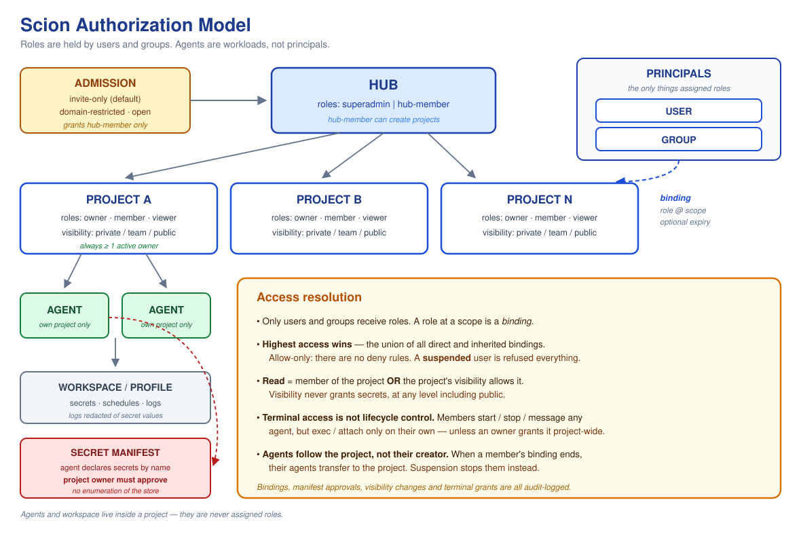

# Scion Role & Permission Model

*A proposal for authorization across the Scion hub, projects, and agents*

---

## 1. Overview

Scion organizes work into a **hub** that contains **projects**, and projects that contain **agents** and their workspace, secrets, schedules, and logs. This proposal defines who can do what across that structure using a deliberately small set of roles. Users and groups are granted roles at the hub or on individual projects; agents act as project-scoped workloads. Access is additive and least-privilege: membership grants visibility, elevated actions require an explicit role, and projects are private until deliberately shared.

---

## 2. Model at a glance

---

## 3. Core concepts

- **Scopes** form a hierarchy: hub › project › the project's agents, workspace, secrets, schedules, and logs.
- **Assignable principals** are the entities that receive role assignments: **users and groups only**.
- **Agents** are workload identities created inside a project. They are *not* assignable principals — they operate under their project's scope with a fixed capability set and never reach outside that project.
- **A binding** attaches a user or group to a scope with a role. Granting access and assigning a role are the same action.
- **Effective access** for a user is the most-permissive union of all their direct and group-inherited bindings.
- **Agent capability grants** are properties of the *project*, not of an agent. Because agents are not principals, any capability beyond the fixed baseline — git pull, for example — is enabled by a project owner for all agents in that project. This keeps agents out of the binding model entirely.

---

## 4. Design principles

| Principle | What it means |
|---|---|
| **Small, fixed role set** | Two hub roles and three project roles — no per-feature tiers. Fewer roles means clearer decisions and easier auditing. |
| **Membership grants access** | Binding a user (or group) to a project with any role is what makes the project visible to them. Assignment and access are the same act. |
| **Highest access wins** | When a user belongs to multiple groups, their effective permissions are the most-permissive union of all bindings. The model is allow-only, so there is no precedence ambiguity. |
| **Private by default** | New projects are private. Visibility is an explicit, deliberate choice — broad access is opted into, never assumed. |
| **Least privilege for workloads** | Agents act only within their own project and start with the minimum they need; elevated capabilities are granted explicitly. |
| **Interactive access is separate from control** | Starting or stopping an agent is a different privilege from opening a terminal inside one. The model separates them. |

### 4.1 Accepted trade-off: allow-only

The model is deliberately **allow-only** — there are no deny rules and no precedence ordering. This buys predictability: effective access is a simple union, and any grant can be explained by pointing at a single binding.

The cost is that **access cannot be carved out**. There is no way to express *"everyone in Engineering except this contractor"*; the only remedy is to unwind every binding that grants the access.

To keep that cost manageable without reintroducing precedence rules, the model provides a **suspended** flag on a user. A suspended user is denied everything regardless of bindings. This covers the urgent cases — offboarding, a compromised account, contractor rotation — without a deny-policy engine.

If per-binding exclusions later become necessary, that is the point at which deny semantics should be revisited, deliberately.

---

## 5. Hub admission

Before any role applies, a person has to become a hub identity at all. The hub has one **admission mode**, set by a superadmin:

| Mode | Who becomes a `hub-member` |
|---|---|
| **invite-only** *(default)* | Only identities an admin has pre-created or invited. Anyone else is refused at login. |
| **domain-restricted** | Any authenticated identity whose email domain is on the allow-list. |
| **open** | Any identity the configured IdP will authenticate. |

**The default is invite-only**, because admission is the one setting whose blast radius is the whole model: in an enterprise SSO deployment, `open` means every employee who can reach the login page becomes a hub-member and can create projects.

Admission grants exactly one thing — the `hub-member` role. It confers no project access whatsoever.

A **suspended** user (§4.1) is refused at login regardless of admission mode or existing bindings.

---

## 6. Roles

Roles are assigned only to **users and groups**. There are two hub roles and three project roles. Hub and project roles are named distinctly, because a single term used at both scopes is a reliable source of confusion.

| Role | Scope | Intent |
|---|---|---|
| **superadmin** | Hub | Full administrative authority across the entire hub. Manages global groups, policies, admission mode, and hub-scoped shared resources. |
| **hub-member** | Hub | Default hub identity. Can create projects; every other capability is earned through a project role. |
| **project-owner** | Project | Full authority over a project: configure, operate, delete, manage secrets, and manage its members. An owner may promote another user to owner (multiple owners supported). |
| **project-member** | Project | Builds and operates within a project: create and run agents, manage the workspace, schedules, and broadcasts. Cannot read secrets or delete the project. |
| **project-viewer** | Project | Read-only visibility into a project, its agents, logs, and metrics. Assigning a viewer role is what grants a user access to a project. |

> *Agents are not listed here because they are not assigned roles. An agent is a workload identity that operates within its own project under a fixed capability set (see the matrix column below).*

### 6.1 Superadmin accountability

Superadmin bypasses every check in this model, so it carries obligations rather than only privileges:

- The number of superadmins should be small and reviewed periodically.
- **Every superadmin action is audit-logged**, including reads, and those logs are not modifiable by superadmins.
- Routine work should not be done as superadmin. Where an operator also owns projects, they should hold `project-owner` for daily use and step up to superadmin deliberately.

### 6.2 Audited actions

Superadmin activity is not the only thing worth recording. The following are audit-logged for **every** principal, with actor, target, and timestamp:

- Creating, changing, or removing a binding — including role changes and expiries
- Approving or revoking a secret manifest (§8)
- Changing a project's visibility
- Granting or revoking project-wide terminal access
- Changing the hub admission mode, or suspending or reinstating a user
- Writing hub-scoped shared resources — templates, skills, harness configs, brokers

These are the events an incident review needs. Anything that widens access should be reconstructable after the fact.

### 6.3 Time-bound bindings

Any binding may carry an optional expiry. On expiry the binding is removed and access reverts with no further action.

This supports temporary elevation — granting `project-owner` for the duration of an incident, or contractor access for the length of an engagement — without depending on someone remembering to revoke it. Bindings without an expiry are permanent, which remains the default.

### 6.4 Ownership continuity

**A project must always have at least one active owner.** An owner is *active* if they are not suspended and their binding has not expired.

- An action that would remove the last active owner — unbinding, suspension, or expiry — is **refused**, and surfaces which project is blocking it.
- To proceed, a new owner is named first. Any existing owner, or a superadmin, may do this.
- A superadmin may reassign ownership at any time, and must do so if a project reaches zero active owners through any path this rule does not catch.

Without this, an ordinary departure silently produces a project nobody can administer.

---

## 7. Visibility

Every project carries a visibility setting that determines who can read it before any explicit membership:

- **Private** (default) — only bound members can see the project and its contents.
- **Team** — members, plus any group bound to the project at any role, can read it.
- **Public** — any hub member can read it. Write and operate still require a project role.

> *Read access is satisfied when a principal is a member of the project **OR** the project's visibility allows it. Everything beyond read requires an explicit project role.*

**Visibility never grants secret access.** Secrets are governed only by project role, at every visibility level including public.

**A project owner may set any visibility, including public, without hub-level approval.** This is intentional — owners are trusted with their own project's exposure — but it means `public` is reachable by any owner, and the change is audit-logged (§6.2).

**An owner may bind an existing group to their project.** This is how team access is granted at any scale, and it means an owner can extend access to a population they do not themselves administer — binding a large group grants every member of it. Owners should treat group bindings with the same care as visibility.

---

## 8. Secrets

Secrets need rules of their own, because the obvious reading of a permission matrix leaves a hole in them: a `project-member` cannot read secrets, but *can* create agents, and agents receive secrets. Without a further constraint, a member could create an agent that simply prints them, defeating the owner-only boundary.

The model closes this with **declared secret manifests**:

- An agent declares the secrets it requires, by name, as part of its configuration.
- A **project owner approves** that manifest. Until approved, the agent runs without those secrets.
- At runtime an agent receives only the values in its approved manifest. It **cannot enumerate** the project's secret store, and cannot request a secret outside its manifest.
- A `project-member` may create agents freely but may not approve a manifest — so they can only reach secrets an owner has already blessed for that purpose.

This preserves a real owner-only boundary while keeping agents useful, and makes secret exposure an explicit, reviewable decision rather than a side effect of agent creation.

> **Residual risk, stated plainly:** any member who can create an agent against an approved manifest can see the values in that manifest. The boundary is per-secret, not absolute. Manifests should therefore be scoped as narrowly as the workload allows.

---

## 9. Agent lifecycle and ownership

Agents are long-running and hold secrets, so their relationship to their creator's access needs to be explicit.

- **Every agent has an owner** — the principal that created it. Ownership determines the `own` qualifiers in the matrix.
- **An agent's access is evaluated against its project, not its creator.** An agent keeps running if its creator's binding changes; it is a project workload, not a personal one.
- **When a principal loses their binding**, their agents do not stop. Ownership transfers to the project, and from then on only project owners may update, delete, or attach to them. This avoids both silent workload termination and orphaned agents nobody can administer.
- **Terminal access follows ownership**, so a departing member's agents become reachable only by owners — not by every remaining member.
- **Deleting a project** deletes its agents, workspace, secrets, schedules, and logs. There is no partial state where an agent outlives its project.

Suspension is the exception: a suspended user's agents are **stopped**, not transferred, on the assumption that suspension may indicate compromise. A project owner may restart them.

---

## 10. Permission matrix

**Legend**

| Code | Meaning | Code | Meaning |
|:--:|---|:--:|---|
| **A** | Allow — role grants directly | **R** | Read — via membership OR project visibility |
| **D** | Deny — not granted | **own** | Own resources only |
| **r/w** | Read and write | **—** | Not applicable at this scope |
| **manifest** | Only the secrets in an owner-approved manifest (§8) | **project grant** | Off by default; enabled per project by an owner (§3) |
| **\*** | Agent is limited to its OWN project only | | |

**Matrix**

Columns are project roles except where a row is marked hub-scoped.

| Resource / Action | Superadmin | Owner | Member | Viewer | Agent\* | Notes |
|---|:--:|:--:|:--:|:--:|:--:|---|
| Project — read / list | A | A | R | R | R | read rule |
| Project — create | A | — | — | — | D | hub-members (hub-scoped) |
| Project — update | A | A | D | D | D | |
| Project — delete | A | A | D | D | D | cascades, §9 |
| Project — clone | A | A | A | D | D | |
| Project — set template | A | A | D | D | D | |
| Project — change visibility | A | A | D | D | D | audited, §7 |
| Agent — read / list | A | A | R | R | A | |
| Agent — create | A | A | A | D | A | core |
| Agent — start / stop / message | A | A | A | D | A | control |
| Agent — exec / attach (terminal) | A | A | A own | D | A | see below |
| Agent — update | A | A | A own | D | D | own only |
| Agent — delete | A | A | A own | D | D | own only |
| Workspace — read / download | A | A | R | R | A | |
| Workspace — write / delete | A | A | A | D | A | |
| WebDAV | A | A | A r/w | R | A | |
| Workspace — pull (git) | A | A | A | D | project grant | §3 |
| Secrets — read | A | A | D | D | manifest | see §8 |
| Secrets — write | A | A | D | D | D | |
| Secrets — approve manifest | A | A | D | D | D | owner only, audited |
| Settings — read / write | A | A | R / D | R / D | R / D | agents read config |
| Shared dirs — read / write | A | A | R / D | R / D | R / D | |
| Pre-start hooks — read / write | A | A | R / D | R / D | R / D | service identity |
| Injected skills — set | A | A | D | D | D | |
| Scheduled events / schedules | A | A | A | D | A | |
| Broadcast to agents | A | A | A | D | A | |
| Message logs / metrics — read | A | A | R | R | R | redacted, §12 |
| Groups (global) — all operations | A | D | D | D | D | hub-scoped |
| Project members group — manage | A | A own | D | D | D | owner, audited |
| Templates / skills / harness configs — read | A | A | R | R | R | hub-scoped |
| Templates / skills / harness configs — write | A | D | D | D | D | runs as code |
| Brokers — read | A | A | R | R | R | hub-scoped |
| Brokers — register / manage | A | D | D | D | D | hub-scoped |
| API tokens — mint for self | A | A | A | A | — | see §11 |
| API tokens — mint for others | A | D | D | D | — | superadmin only |

> *\* Agent permissions apply only within the agent's own project.*

**Terminal access.** A member may open a terminal on their own agents only. A **project owner may grant project-wide terminal access** to a specific member, raising them to `A` on that row for every agent in that project. The grant is per project and per member — not per agent — and is audit-logged. There is no mechanism for a member to grant it to themselves or to others.

**Why members cannot write pre-start hooks**, despite being able to write the workspace and create agents: hooks execute as the hub's service identity, outside the agent sandbox and before any agent isolation applies. Workspace content and agent code run *inside* the sandbox. The distinction is the execution context, not the fact that code runs.

---

## 11. API tokens

Automation authenticates with tokens, so tokens need a defined position in the model:

- A token **never carries more access than its holder has at the time of use**. Permissions are evaluated live against current bindings, not captured when the token is minted.
- Consequently, **revoking a user's binding immediately reduces the reach of their tokens**, and suspending a user disables their tokens outright. No separate revocation sweep is required.
- A token may be **narrowed** at mint time — restricted to a single project, or to a subset of actions — but never widened.
- Only superadmins may mint a token on another principal's behalf.

---

## 12. Notes

- Secrets are restricted to project owners; members and viewers work with references rather than values, and agents receive only an owner-approved manifest (§8).
- Members may delete, update, and open terminals only on the agents they own; they may start, stop, and message any agent in the project. An owner may widen terminal access per member (§10).
- Agents may create other agents within their project. Capabilities beyond the baseline — git pull, for example — are enabled per project by an owner, not per agent.
- Global group management, and write access to hub-scoped shared resources (templates, skills, harness configs, brokers), are reserved for hub superadmins. A project owner may manage its own project membership.
- **Logs and message history are assumed to be redacted** of secret values before storage. Viewers can read logs, so unredacted logs would silently defeat the secret boundary in §8.
- **Cross-project agent interaction is out of scope.** Agents cannot address, message, or discover agents in other projects. If that becomes a requirement it needs its own model — it is the one thing that would breach project isolation by design.
- **Resource limits are out of scope for this model.** Nothing here bounds how many agents a member may create or what they may consume. Authorization answers *may they*, not *how much* — quotas are a separate concern and should not be simulated with roles.
